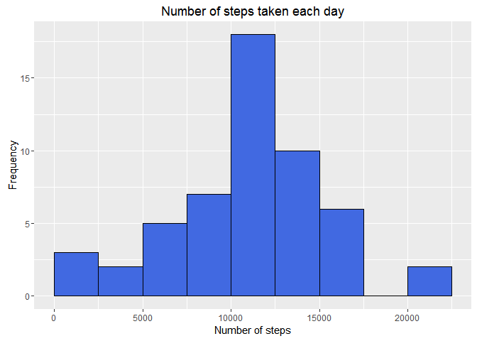
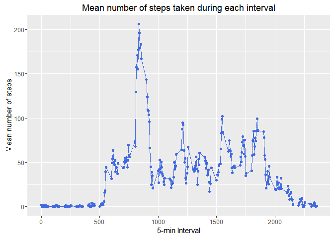
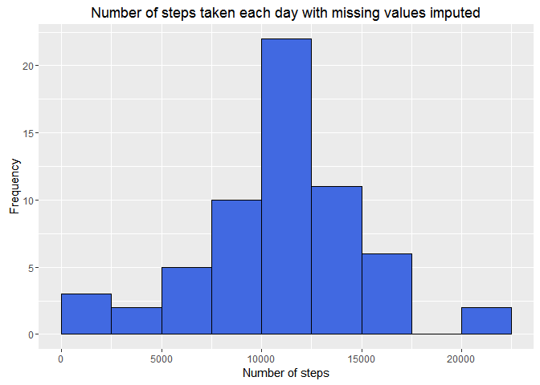
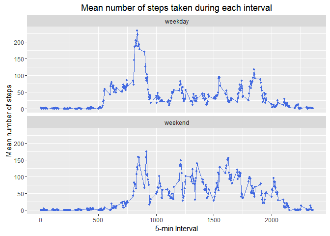

# Reproducible Research: Peer Assessment 1

## Preliminary

Load knitr

```r
library(knitr)
```

Change default knitr figure path

```r
opts_chunk$set( fig.path = 
  paste( 'figure', .Platform$file.sep, sep = '' ) )
```


## Loading and preprocessing the data

Declare the path to the zipfile containing the data file

```r
DATA_ZIPFILE_PATH <- 'activity.zip'
```

Declare the local path to data CSV file as specified by the directory structure of the zipfile

```r
DATA_FILE_LOCAL_PATH <- 'activity.csv'
```

Create path to the temporary data directory where the zipfile will be extracted

```r
data_dir_path <- tempfile( )
```

Extract zipfile to temporatory data directory

```r
unzip(
  zipfile = DATA_ZIPFILE_PATH,
  exdir = data_dir_path )
```

Build the path to data CSV file

```r
data_file_path <- file.path(
  data_dir_path,
  DATA_FILE_LOCAL_PATH )
```

### Load the data (i.e. read.csv())

Read the CSV file into a data frame specifying column classes

```r
df <- read.csv(
  file = data_file_path,
  colClasses = c( 'numeric', 'Date', 'numeric' ) )
```


## What is mean total number of steps taken per day?


### Calculate the total number of steps taken per day

Compute the total number of steps taken each day

```r
daily_step_sum <- aggregate(
  formula = steps ~ date,
  data = df,
  FUN = sum,
  na.action = na.omit )
```


### Histogram of the total number of steps taken each day

Load ggplot

```r
library(ggplot2)
```

Use a histogram to plot the frequency of steps taken each day

```r
h <- ggplot(
  data = daily_step_sum,
  mapping = aes( x = steps ) )

h <- h + geom_histogram(
  binwidth = 2500,
  boundary = 0,
  col = 'black', 
  fill = 'royalblue' )

h <- h + labs(
  title = 'Number of steps taken each day',
  x = 'Number of steps',
  y = 'Frequency' )
  
print( h )
```

<!-- -->


### Mean and median number of steps taken each day

Calculate the mean number of steps per day

```r
mean( daily_step_sum$steps )
```

```
## [1] 10766.19
```

Calculate the median number of steps per day

```r
median( daily_step_sum$steps )
```

```
## [1] 10765
```


## What is the average daily activity pattern?

Compute the mean number of steps taken for each interval

```r
interval_step_avg <- aggregate(
  formula = steps ~ interval,
  data = df,
  FUN = mean,
  na.action = na.omit )
```

### Time series plot of the average number of steps taken

Depict the average number of step for each interval using a line plot

```r
h <- ggplot(
  data = interval_step_avg,
  mapping = aes( 
    x = interval,
    y = steps,
    group = 1) )

h <- h + geom_line(
  col = 'royalblue' )

h <- h + geom_point(
  col = 'royalblue' )

h <- h + labs(
  title = 'Mean number of steps taken during each interval',
  x = '5-min Interval',
  y = 'Mean number of steps' )

print( h )
```

<!-- -->

### The 5-minute interval that, on average, contains the maximum number of steps

Find and report of interval that on average contains the maximum number of steps

```r
interval_step_avg$interval[ which.max( interval_step_avg$steps ) ]
```

```
## [1] 835
```


## Imputing missing values

Calculate and report the total number of missing values in the dataset for each column

```r
col_na_count <- sapply( df, function(x) sum(is.na(x)) )
print( col_na_count )
```

```
##    steps     date interval 
##     2304        0        0
```

Only the steps column is missing values.

Report the total number of missing steps values

```r
print( col_na_count[1] )
```

```
## steps 
##  2304
```

Report the fraction of step entries missing values

```r
mean( is.na( df$steps ) )
```

```
## [1] 0.1311475
```


### Code to describe and show a strategy for imputing missing data

Missing step values are imputed by replacing NA with the average number of steps taken during a given interval for a given weekday.

First, we a column with a unique id column (uid) for each interval-weekday

```r
df$uid <- paste( 
  weekdays( df$date, abbreviate = TRUE ),
  sprintf( '%03d', df$interval / 5 ),
  sep = '-' )
```

Next, compute average number of steps taken during each uid

```r
df_uid_avg <- aggregate(
  formula = steps ~ uid,
  data = df,
  FUN = mean,
  na.action = na.omit )
```

Convert data frame columns into a (labeled) vector

```r
uid_avg <- df_uid_avg$steps
names(uid_avg) <- df_uid_avg$uid
```

Copy original steps values to new column of imputed steps (isteps)

```r
df$isteps <- df$steps
```

Replace NA value of istep with interval-weekday average

```r
na_mask <- is.na( df$isteps )
df$isteps[ na_mask ] <- uid_avg[ df$uid[ na_mask ] ]
```


### Histogram of the total number of steps taken each day after missing values are imputed

Compute the mean number of steps taken each day

```r
daily_istep_sum <- aggregate(
  formula = isteps ~ date,
  data = df,
  FUN = sum,
  na.action = na.omit )
```

Use a histogram to plot the frequency of imputed steps (isteps) taken each day

```r
h <- ggplot(
  data = daily_istep_sum,
  mapping = aes( x = isteps ) )

h <- h + geom_histogram(
  binwidth = 2500,
  boundary = 0,
  col = 'black', 
  fill = 'royalblue' )

h <- h + labs(
  title = 'Number of steps taken each day with missing values imputed',
  x = 'Number of steps',
  y = 'Frequency' )

print( h )
```

<!-- -->

### Mean and median number of steps taken each day with imputed missing values

Calculate the mean number of steps per day

```r
mean( daily_istep_sum$isteps )
```

```
## [1] 10821.21
```

Calculate the median number of steps per day

```r
median( daily_istep_sum$isteps )
```

```
## [1] 11015
```


## Are there differences in activity patterns between weekdays and weekends?


### Create a new factor variable in the dataset with two levels - 'weekday' and 'weekend'

Create a factor variable with the weekday name for each date

```r
weekday_name <- factor( 
  x = weekdays( df$date ),
  levels = c(
    'Monday',
    'Tuesday',
    'Wednesday',
    'Thursday',
    'Friday',
    'Saturday',
    'Sunday' ) )
```

Add a column with the type of day ('weekday'/'weekend'), use the explicit factor ordering for weekday column to build column

```r
df$weekday_type <- factor(
  x = ( as.integer( weekday_name ) %/% 6L + 1L ),
  labels = c(
    'weekday',
    'weekend' ) )
```


### Panel plot comparing the average number of steps taken per 5-minute interval across weekdays and weekends

Compute the mean number of steps taken for each interval and weekday type

```r
interval_istep_avg <- aggregate(
  formula = steps ~ interval + weekday_type,
  data = df,
  FUN = mean )
```

Depict the average number of step for each interval using a line plot

```r
h <- ggplot(
  data = interval_istep_avg,
  mapping = aes( 
    x = interval,
    y = steps ) )

h <- h + geom_line(
  col = c( 'royalblue' ) )

h <- h + geom_point(
  col = 'royalblue',
  size = 1 )

h <- h + facet_wrap(
  facets = ~ weekday_type,
  ncol = 1 )

h <- h + labs(
  title = 'Mean number of steps taken during each interval',
  x = '5-min Interval',
  y = 'Mean number of steps' )

print( h )
```

<!-- -->

### The 5-minute interval that, on average, contains the maximum number of steps for weekdays and weekends

Calculate the row indices with the maximum number of steps for weekdays and weekends

```r
row_indices <- with( interval_istep_avg,
  tapply(
    X = steps,
    INDEX = weekday_type,
    FUN = which.max ) )
```

The interval that on average contains the maximum number of steps for weekdays is

```r
interval_istep_avg$interval[ row_indices[ 'weekday' ] ]
```

```
## [1] 835
```

The interval that on average contains the maximum number of steps for weekends is

```r
interval_istep_avg$interval[ row_indices[ 'weekend' ] ]
```

```
## [1] 915
```

